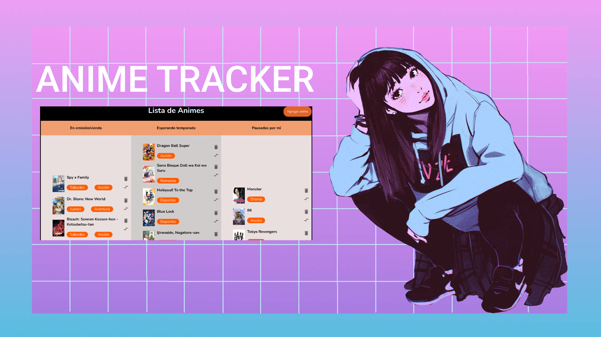

# ⛩️🍥🍜 Anime Tracker

> © Desarrollado por Valentin Chianese
## Descripción

Anime Tracker es una aplicación web, la cual permite a cada usuario registrar su propia tabla de animes, para mantener un seguimiento de los mismos. El objetivo del proyecto es abandonar ese bloc de notas o anotador, y hacer uso de un servicio en línea que nos facilita más las cosas.

Las características principales del proyecto son:

- **Registro de usuarios:** La aplicación web cuenta con un formulario de registro en el cual se le pedirán los datos al usuario para que quede registrado en el sistema. Luego deberá confirmar su cuenta con un código que le enviaremos al mail que registró.

- **Logeo de usuarios:** Junto con el registro se deberá iniciar sesión en la aplicación web para hacer uso de la funcionalidad de la tabla.

- **Tabla de anime:** Como funcionalidad principal tenemos una tabla donde el usuario podrá registrar sus anime según el estado en el que los lleve, es decir, tenemos 3 columnas para las tablas, “En emisión/viendo”, “Esperando temporada”, “Pausado por mí”. Se cuenta con un formulario para buscar el anime elegido, y también se debe indicar en qué columna de la tabla irá a parar. Luego una vez agregados a la tabla, los animes se pueden cambiar de columna o eliminar. Los anime muestran la siguiente información: Portada, Título, Día de emisión (en caso de estarlo) y Género.

El proyecto está dividido en Frontend (Con React + Vite), Backend (Con Java y Spring Boot) y Base de datos (PostgreSQL). Contando con el entorno de producción, estas son las tecnologías que se utilizaron :

- Java
- Spring Boot
- React
- Vite
- JavaScript
- PostgreSQL
- Vercel
- Railway

El proyecto del lado del backend fue desarrollado con el IDE Visual Studio Code y Maven. Y por el lado del frontend, con el mismo IDE y Vite para la creación del proyecto. El tiempo de desarrollo fue de aproximadamente 2 meses.

## Implementación

La implementación del proyecto se llevó a cabo en las siguientes etapas:
- **Landing page:** La landing page es la página principal de la aplicación, donde los usuarios pueden registrarse o iniciar sesión. Para el registro, se utilizó una estrategia de verificación de correo electrónico para validar la identidad del usuario. Cuando el usuario envía sus datos de registro, se le envía un correo electrónico con un código de verificación. El usuario debe ingresar el código en la página de registro para completar el proceso.

- **Inicio de sesión:** Para el inicio de sesión, se utilizó la API de cookies de React para persistir la sesión del usuario. Cuando el usuario inicia sesión, se genera una cookie que almacena el token de sesión. Esta cookie se utiliza para identificar al usuario en futuras solicitudes.

- **Ruteo:** El ruteo de la aplicación se manejó con react-router-dom. Esto permite que la aplicación tenga rutas protegidas que solo pueden ser accedidas por usuarios logeados.

- **Integración con Crunchyroll:** Cuando el usuario hace clic en el nombre de un anime en la tabla, se lo redirige a la búsqueda de ese título en Crunchyroll (si es que existe en esa página). Esto permite a los usuarios ver más detalles sobre el anime, como su sinopsis, calificación y disponibilidad en Crunchyroll.

- **Traducción:** Los días de emisión y los géneros de los animes se tradujeron al español utilizando un diccionario. Esto se hizo porque la API de Jikan.moe devuelve la información en inglés.

### Estrategias utilizadas

Las siguientes estrategias se utilizaron para implementar el proyecto:

- **Verificación de correo electrónico:** La verificación de correo electrónico es una estrategia de seguridad que ayuda a que se necesite un correo real para registrarse. Al requerir que los usuarios verifiquen sus direcciones de correo electrónico luego de registrarse, se reduce el riesgo de tener muchos usuarios falsos en la página.

- **Uso de cookies:** Las cookies son pequeños archivos que se almacenan en el navegador del usuario. Se pueden utilizar para almacenar información sobre el estado de la sesión del usuario, como el token de sesión.

- **Ruteo protegido:** El ruteo protegido permite que la aplicación tenga rutas que solo pueden ser accedidas por usuarios logeados. Esto ayuda a proteger la información confidencial de los usuarios.

- **Uso de una API:** Las API proporcionan una forma conveniente de acceder a datos de terceros. En este caso, se utilizó la API de Jikan.moe para obtener información sobre animes.

- **Integración con otra aplicación:** La integración con otra aplicación permite que las aplicaciones funcionen juntas. En este caso, se integró la aplicación con Crunchyroll para permitir a los usuarios ver más detalles sobre los animes.

- **Traducción:** La traducción es una forma de hacer que la información sea accesible a un público más amplio. En este caso, se tradujeron los días de emisión y los géneros de los animes al español.

## Captura de pantalla

## Despliegue
Para el despliegue de toda la aplicación web se utilizaron diferentes sitios de acuerdo a las necesidades del proyecto.

El entorno de producción del frontend se desplegó en Vercel, debido a que no es una aplicación que utilice demasiados recursos, el plan gratuito de Vercel fue suficiente para garantizar el despliegue del frontend.

Para el entorno de producción del backend se utilizó Railway como sitio para el despliegue, debido a la misma razón que para el frontend, Railway proporciona lo justo y necesario para que el proyecto se mantenga funcionando correctamente.

Por último para la base de datos PostgreSQL también se utilizó Vercel.

## Sitio web
En este link se encuentra desplegada la aplicación web, puedes probarla sin problemas.
<a href="https://anime-project-frontend-m9d6.vercel.app/landing">Anime Tracker - App web</a>

## Contribuciones

Este proyecto fue desarrollado como parte de un proyecto personal y se aceptan cualquier tipo de contribuciones externas. Agradecemos tus comentarios y sugerencias para mejorar el sistema en futuras versiones.

## Créditos

Desarrollado por [Valentin Chianese](https://github.com/ImLevan).

